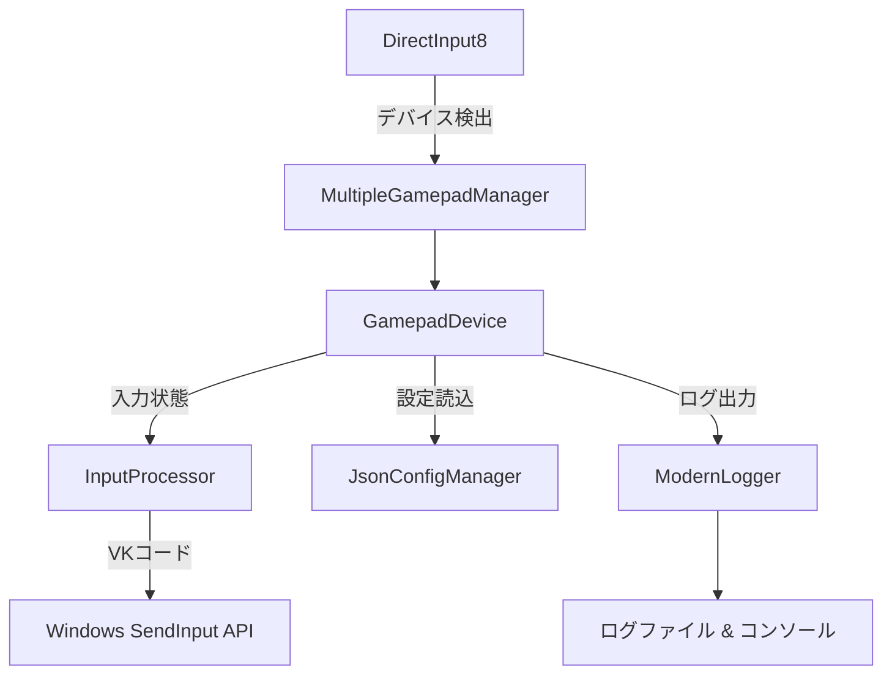

# GamepadMapper 開発者ガイド

## 📋 目次
- [開発環境セットアップ](#開発環境セットアップ)
- [アーキテクチャ概要](#アーキテクチャ概要)
- [コーディング規約](#コーディング規約)
- [ログシステム使用法](#ログシステム使用法)
- [ビルド・テスト](#ビルドテスト)
- [コントリビューション](#コントリビューション)
- [トラブルシューティング](#トラブルシューティング)

---

## 🛠️ 開発環境セットアップ

### 必要な環境
- **コンパイラ**: MinGW-w64 (GCC 9.0+) または Visual Studio 2019+
- **CMake**: 3.20以上
- **vcpkg**: パッケージ管理
- **Git**: バージョン管理

### 依存ライブラリ
```json
{
  "dependencies": {
    "spdlog": "^1.16.0",
    "nlohmann-json": "^3.12.0", 
    "fmt": "^12.0.0"
  }
}
```

### セットアップ手順
```bash
# 1. リポジトリクローン
git clone <repository-url>
cd GamepadMapper

# 2. ビルド実行
bash build.sh

# 3. 実行確認
./build/GamepadMapper.exe
```

---

## 🏗️ アーキテクチャ概要

### モジュール構成
```
GamepadMapper/
├── 📁 Core/
│   ├── Application.{h,cpp}           # メインアプリケーションループ
│   ├── MultipleGamepadManager.{h,cpp} # 複数デバイス統合管理
│   └── GamepadDevice.{h,cpp}         # 個別デバイス制御
├── 📁 Input/
│   ├── InputProcessor.{h,cpp}        # 入力→キーボード変換
│   └── KeyResolver.{h,cpp}          # キー名→VKコード解決
├── 📁 Config/
│   └── JsonConfigManager.{h,cpp}     # JSON設定ファイル管理
├── 📁 UI/
│   ├── WindowManager.{h,cpp}         # ウィンドウ管理
│   └── DisplayBuffer.{h,cpp}         # 状態表示バッファ
└── 📁 System/
    ├── ModernLogger.{h,cpp}          # 構造化ログシステム
    └── ILogger.h                     # ログインターフェース
```

### データフロー


### 主要インターフェース

#### ILogger (ログ出力統一)
```cpp
class ILogger {
public:
    virtual bool Init(const std::string& logFilePath) = 0;
    virtual void Write(const char* fmt, ...) = 0;
    virtual void WriteW(const wchar_t* fmt, ...) = 0;
    virtual void AppendFrameLog(const wchar_t* fmt, ...) = 0;
    // ... その他
};
```

#### IDisplayBuffer (状態表示統一)
```cpp
class IDisplayBuffer {
public:
    virtual void AddGamepadState(const std::wstring& deviceName, 
                               const DIJOYSTATE2& state) = 0;
    virtual void Clear() = 0;
    virtual const std::vector<std::wstring>& GetDisplayLines() const = 0;
};
```

---

## 📝 コーディング規約

### 1. **命名規則**

#### クラス・構造体
```cpp
// ✅ 良い例: PascalCase
class GamepadDevice;
struct SystemConfig;

// ❌ 悪い例
class gamepad_device;
class gamepadDevice;
```

#### 関数・変数
```cpp
// ✅ 良い例: camelCase
void processInput();
int deviceCount;

// ✅ メンバ変数: m_プレフィックス
class GamepadDevice {
private:
    std::wstring m_deviceName;
    bool m_connected;
};

// ✅ 定数: k_プレフィックス
const int k_MaxDevices = 16;
```

#### ファイル名
```cpp
// ✅ 良い例: PascalCase + 拡張子
GamepadDevice.h
InputProcessor.cpp

// ❌ 悪い例
gamepad_device.h
inputprocessor.cpp
```

### 2. **インクルード順序**
```cpp
// 1. 対応するヘッダーファイル
#include "GamepadDevice.h"

// 2. C++標準ライブラリ
#include <memory>
#include <string>
#include <vector>

// 3. サードパーティライブラリ
#include <spdlog/spdlog.h>
#include <nlohmann/json.hpp>

// 4. Windows API (最後)
#include <windows.h>
#include <dinput.h>
```

### 3. **コメント規約**
```cpp
/**
 * @brief デバイスを初期化します
 * @param pDirectInput DirectInput8インターフェース
 * @param pdidInstance デバイスインスタンス情報
 * @param hWnd ウィンドウハンドル
 * @return 成功時true、失敗時false
 */
bool Initialize(IDirectInput8* pDirectInput, 
               const DIDEVICEINSTANCE* pdidInstance, 
               HWND hWnd);

// 単行コメントは日本語OK
// デバイスの接続状態をチェック
if (!m_connected) {
    return false;
}
```

### 4. **エラーハンドリング**
```cpp
// ✅ 良い例: HRESULTチェック + ログ
HRESULT hr = m_device->Acquire();
if (FAILED(hr)) {
    LOG_ERROR("Device acquisition failed. HRESULT: 0x{:08X}", hr);
    return false;
}

// ✅ 良い例: 例外安全
try {
    auto config = JsonConfigManager::load(configPath);
    // ... 処理
} catch (const std::exception& e) {
    LOG_ERROR("Configuration loading failed: {}", e.what());
    return false;
}
```

---

## 📊 ログシステム使用法

### ModernLogger API

#### 基本ログレベル
```cpp
#include "ModernLogger.h"

// エラー: システムの継続に影響する問題
LOG_ERROR("Failed to initialize DirectInput. HRESULT: 0x{:08X}", hr);

// 警告: 機能に影響するが回復可能
LOG_WARN("Device disconnected: {}. Attempting reconnection...", deviceName);

// 情報: 重要な状態変化
LOG_INFO("New gamepad detected: {} ({})", productName, instanceName);

// デバッグ: 詳細な実行トレース
LOG_DEBUG("Button {} pressed: VK sequence [{}]", buttonIndex, vkSequence);
```

#### 日本語文字列ログ
```cpp
// Wide string版（日本語デバイス名等）
LOG_INFO_W(L"ゲームパッド検出: " + deviceName);
LOG_ERROR_W(L"設定ファイル読み込み失敗: " + configPath);
```

#### フレームログ（リアルタイム表示用）
```cpp
// ゲーム内表示用の高頻度ログ
ModernLogger::GetInstance().AppendFrameLog(L"Button%d: %s", 
                                          buttonIndex, 
                                          pressed ? L"ON" : L"OFF");
```

### ログレベル設定
```cpp
// プログラムで動的変更
ModernLogger::GetInstance().SetLogLevel(spdlog::level::debug);

// 設定ファイル経由
{
  "config": {
    "log_level": "debug"  // trace, debug, info, warn, error, critical
  }
}
```

---

## 🔨 ビルド・テスト

### ビルドコマンド
```bash
# 通常ビルド
bash build.sh

# クリーンビルド  
bash build.sh --clean

# デバッグビルド
cmake --build build --config Debug
```

### 単体テストの追加
```cpp
// テスト用ファイルの命名: test_ModuleName.cpp
// 例: test_InputProcessor.cpp
#include "InputProcessor.h"
#include <cassert>

void test_VirtualKeyMapping() {
    InputProcessor processor;
    // テストケース実装
    assert(processor.IsValidKey("a"));
    assert(!processor.IsValidKey("invalid"));
}
```

### デバッグビルドでの追加ログ
```cpp
#ifdef _DEBUG
    LOG_DEBUG("Debug build: Extra validation enabled");
    // デバッグ専用コード
#endif
```

---

## 🤝 コントリビューション

### Pull Request プロセス

1. **ブランチ作成**
```bash
git checkout -b feature/new-gamepad-support
# または
git checkout -b bugfix/device-reconnection-issue
```

2. **コミットメッセージ規約**
```bash
# 形式: <type>: <description>
git commit -m "feat: Add Xbox Series X controller support"
git commit -m "fix: Resolve device reconnection memory leak"
git commit -m "docs: Update API documentation for InputProcessor"

# タイプ:
# feat: 新機能
# fix: バグ修正  
# docs: ドキュメント
# refactor: リファクタリング
# test: テスト追加
# style: コードスタイル修正
```

3. **コードレビューチェックリスト**
- [ ] ビルドが通る (`bash build.sh`)
- [ ] ログレベルが適切に設定されている
- [ ] メモリリークがない
- [ ] 命名規則に従っている
- [ ] コメントが適切に記述されている
- [ ] エラーハンドリングが実装されている

### 新機能追加ガイドライン

#### 新しいデバイスサポート追加
1. `GamepadDevice.cpp`に検出ロジック追加
2. `JsonConfigManager`にデフォルト設定定義
3. `InputProcessor`に固有入力処理実装
4. テスト用設定ファイル作成

#### 新しいキーマッピング追加
1. `KeyResolver.cpp`にキー名定義
2. `JsonConfigManager`にバリデーション追加
3. ドキュメント更新

---

## 🔧 トラブルシューティング

### よくある問題と解決法

#### ビルドエラー
```bash
# vcpkgの依存関係問題
Error: Could not find spdlog

# 解決法
vcpkg install spdlog:x64-mingw-dynamic
vcpkg integrate install
```

#### ランタイムエラー
```cpp
// 問題: DirectInput初期化失敗
HRESULT: 0x80070005 (Access Denied)

// 解決法: 管理者権限で実行、またはコンパイル時設定確認
```

#### デバイス認識されない
```cpp
// デバッグログで確認
LOG_DEBUG("Scanning devices...");
// EnumDevices callback内でデバイス情報ログ出力
```

#### 設定ファイルが反映されない
```cpp
// 設定ファイルパスとアクセス権限確認
LOG_DEBUG_W(L"Config file path: " + configPath);
LOG_DEBUG_W(L"File exists: " + (exists ? L"YES" : L"NO"));
```

### ログファイル確認
```bash
# ログ出力先
./gamepad_mapper.log           # メインログ
./gamepad_config_*.json        # デバイス別設定
```

### パフォーマンス分析
```cpp
// 高頻度処理のプロファイリング
auto start = std::chrono::high_resolution_clock::now();
// ... 処理 ...
auto end = std::chrono::high_resolution_clock::now();
LOG_DEBUG("Processing time: {}ms", 
         std::chrono::duration_cast<std::chrono::milliseconds>(end - start).count());
```

---

## 📚 参考資料

### 外部ドキュメント
- [DirectInput8 公式リファレンス](https://docs.microsoft.com/en-us/previous-versions/windows/desktop/ee416842(v=vs.85))
- [spdlog GitHub](https://github.com/gabime/spdlog)
- [nlohmann/json GitHub](https://github.com/nlohmann/json)

### プロジェクト内ドキュメント
- `README.md`: ユーザー向け使用方法
- `LOG_SYSTEM_SEPARATION_ANALYSIS.md`: ログシステム設計分析
- `LOGGER_IMPROVEMENT_ANALYSIS.md`: ログライブラリ改善方針

---

**最終更新: 2024年**  
**メンテナー: Rovo Dev**