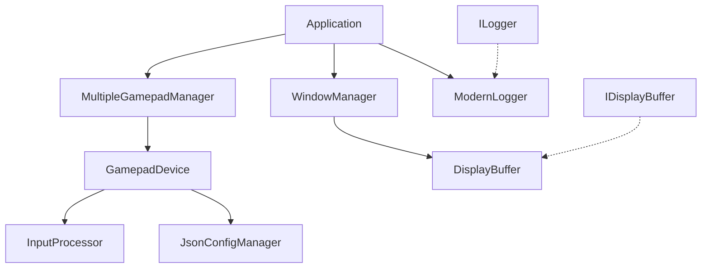

# GamepadMapper API リファレンス

## 📋 目次
- [クラス階層](#クラス階層)
- [コアクラス](#コアクラス)
- [入力処理](#入力処理)
- [設定管理](#設定管理)
- [ログシステム](#ログシステム)
- [ユーティリティ](#ユーティリティ)

---

## 🏗️ クラス階層



---

## 🎮 コアクラス

### Application
**概要**: メインアプリケーションクラス、全体の初期化と実行ループを管理

#### 公開メソッド

```cpp
class Application {
public:
    /**
     * @brief アプリケーションを初期化
     * @param hInstance アプリケーションインスタンス
     * @param nCmdShow ウィンドウ表示状態
     * @return 成功時true
     */
    bool Initialize(HINSTANCE hInstance, int nCmdShow);
    
    /**
     * @brief メインループ実行
     * @return 終了コード
     */
    int Run();
    
    /**
     * @brief リソースを解放して終了
     */
    void Shutdown();
    
private:
    std::unique_ptr<WindowManager> m_windowManager;
    std::unique_ptr<MultipleGamepadManager> m_gamepadManager;
    std::unique_ptr<DisplayBuffer> m_displayBuffer;
    bool m_initialized;
};
```

#### 使用例
```cpp
Application app;
if (!app.Initialize(hInstance, nCmdShow)) {
    return -1;
}
return app.Run();
```

---

### MultipleGamepadManager
**概要**: 複数ゲームパッドの統合管理、デバイス検出・列挙・状態監視

#### 公開メソッド

```cpp
class MultipleGamepadManager {
public:
    /**
     * @brief DirectInput8を初期化し、デバイススキャン開始
     * @param hWnd ウィンドウハンドル
     * @return 成功時true
     */
    bool Initialize(HWND hWnd);
    
    /**
     * @brief 全デバイスをシャットダウン
     */
    void Shutdown();
    
    /**
     * @brief デバイス状態をポーリング（フレーム毎実行）
     */
    void PollAllDevices();
    
    /**
     * @brief 新しいデバイスをスキャン（5秒間隔推奨）
     */
    void ScanForNewDevices();
    
    /**
     * @brief 接続中のデバイス数を取得
     * @return デバイス数
     */
    size_t GetConnectedDeviceCount() const;
    
    /**
     * @brief 指定インデックスのデバイス取得
     * @param index デバイスインデックス
     * @return デバイスポインタ（nullptr if invalid）
     */
    std::shared_ptr<GamepadDevice> GetDevice(size_t index) const;
    
private:
    Microsoft::WRL::ComPtr<IDirectInput8> m_directInput;
    std::vector<std::shared_ptr<GamepadDevice>> m_devices;
    HWND m_hWnd;
    bool m_initialized;
    
    static BOOL CALLBACK EnumGamepadsCallback(
        const DIDEVICEINSTANCE* pdidInstance, void* pContext);
};
```

#### 使用例
```cpp
MultipleGamepadManager manager;
if (manager.Initialize(hWnd)) {
    // メインループ内
    manager.PollAllDevices();
    
    // 定期実行（5秒毎）
    manager.ScanForNewDevices();
    
    // デバイス情報取得
    for (size_t i = 0; i < manager.GetConnectedDeviceCount(); ++i) {
        auto device = manager.GetDevice(i);
        if (device && device->IsConnected()) {
            // デバイス処理
        }
    }
}
```

---

### GamepadDevice
**概要**: 個別ゲームパッドデバイスの管理、設定読み込み、入力処理

#### 公開メソッド

```cpp
class GamepadDevice {
public:
    /**
     * @brief デバイスを初期化
     * @param pDirectInput DirectInput8インターフェース
     * @param pdidInstance デバイスインスタンス情報
     * @param hWnd ウィンドウハンドル
     * @return 成功時true
     */
    bool Initialize(IDirectInput8* pDirectInput, 
                   const DIDEVICEINSTANCE* pdidInstance, 
                   HWND hWnd);
    
    /**
     * @brief デバイスをシャットダウン
     */
    void Shutdown();
    
    /**
     * @brief 入力を処理（フレーム毎実行）
     */
    void ProcessInput();
    
    /**
     * @brief 再接続を試行
     * @param pDirectInput DirectInput8インターフェース
     * @param hWnd ウィンドウハンドル
     * @return 成功時true
     */
    bool TryToReconnect(IDirectInput8* pDirectInput, HWND hWnd);
    
    // Getters
    const std::wstring& GetName() const { return m_deviceName; }
    const std::wstring& GetInstanceName() const { return m_deviceInstanceName; }
    bool IsConnected() const { return m_connected; }
    bool IsInitialized() const { return m_initialized; }
    const DIJOYSTATE2& GetCurrentState() const { return m_currentState; }
    
    /**
     * @brief 表示バッファを設定
     * @param displayBuffer バッファインターフェース
     */
    void SetDisplayBuffer(std::shared_ptr<IDisplayBuffer> displayBuffer);
    
private:
    Microsoft::WRL::ComPtr<IDirectInputDevice8> m_device;
    std::unique_ptr<JsonConfigManager> m_configManager;
    std::unique_ptr<InputProcessor> m_inputProcessor;
    std::shared_ptr<IDisplayBuffer> m_displayBuffer;
    
    std::wstring m_deviceName;
    std::wstring m_deviceInstanceName;
    GUID m_deviceGUID;
    DIJOYSTATE2 m_currentState;
    
    bool m_initialized;
    bool m_connected;
    bool m_acquired;
    std::string m_configFilePath;
};
```

#### 使用例
```cpp
auto device = std::make_shared<GamepadDevice>();
if (device->Initialize(pDirectInput, &deviceInstance, hWnd)) {
    LOG_INFO_W(L"Device initialized: " + device->GetName());
    
    // 表示バッファ設定
    device->SetDisplayBuffer(displayBuffer);
    
    // メインループ内
    device->ProcessInput();
    
    // 接続状態チェック
    if (!device->IsConnected()) {
        device->TryToReconnect(pDirectInput, hWnd);
    }
}
```

---

## ⌨️ 入力処理

### InputProcessor
**概要**: ゲームパッド入力をキーボード入力に変換

#### 公開メソッド

```cpp
class InputProcessor {
public:
    /**
     * @brief デフォルトコンストラクタ
     */
    InputProcessor();
    
    /**
     * @brief 設定付きコンストラクタ
     * @param config 設定管理オブジェクト
     */
    explicit InputProcessor(const JsonConfigManager& config);
    
    /**
     * @brief 設定を更新
     * @param config 新しい設定
     */
    void SetConfig(const JsonConfigManager& config);
    
    /**
     * @brief ゲームパッド入力を処理
     * @param js ジョイスティック状態
     */
    void ProcessGamepadInput(const DIJOYSTATE2& js);
    
    /**
     * @brief 状態をリセット
     */
    void ResetState();
    
private:
    static constexpr size_t MAX_BUTTONS = 128;
    static constexpr size_t AX_UP = 0, AX_DOWN = 1, AX_LEFT = 2, AX_RIGHT = 3;
    
    std::array<bool, MAX_BUTTONS> m_prevButtons;
    std::array<bool, 4> m_prevAxisDown;
    DWORD m_prevPOV;
    const JsonConfigManager* m_configManager;
    
    void ProcessButtons(const DIJOYSTATE2& js);
    void ProcessPOV(const DIJOYSTATE2& js);
    void ProcessAnalogSticks(const DIJOYSTATE2& js);
    
    void SendVirtualKey(WORD vk, bool down);
    void SendVirtualKeySequence(const std::vector<WORD>& vks, bool down);
};
```

#### 使用例
```cpp
JsonConfigManager config("device_config.json");
config.load();

InputProcessor processor(config);

// メインループ内
DIJOYSTATE2 joyState;
if (SUCCEEDED(device->GetDeviceState(sizeof(joyState), &joyState))) {
    processor.ProcessGamepadInput(joyState);
}
```

---

### KeyResolver
**概要**: キー名文字列をWindows仮想キーコードに変換

#### 公開メソッド

```cpp
class KeyResolver {
public:
    /**
     * @brief キー名をVKコードに変換
     * @param keyName キー名（"a", "ctrl", "f1"等）
     * @return VKコード（0は無効）
     */
    static WORD ResolveKey(const std::string& keyName);
    
    /**
     * @brief キー名配列をVKコード配列に変換
     * @param keyNames キー名配列
     * @return VKコード配列
     */
    static std::vector<WORD> ResolveKeys(const std::vector<std::string>& keyNames);
    
    /**
     * @brief キー名が有効かチェック
     * @param keyName キー名
     * @return 有効時true
     */
    static bool IsValidKey(const std::string& keyName);
    
    /**
     * @brief サポートされるキー名一覧を取得
     * @return キー名配列
     */
    static std::vector<std::string> GetSupportedKeys();
    
private:
    static const std::unordered_map<std::string, WORD> s_keyMap;
};
```

#### 使用例
```cpp
// 単一キー
WORD vkA = KeyResolver::ResolveKey("a");           // VK_A
WORD vkF1 = KeyResolver::ResolveKey("f1");         // VK_F1

// 複数キー組み合わせ
std::vector<std::string> combo = {"ctrl", "alt", "delete"};
auto vkCodes = KeyResolver::ResolveKeys(combo);    // {VK_CONTROL, VK_MENU, VK_DELETE}

// バリデーション
if (KeyResolver::IsValidKey("printscreen")) {
    // 有効なキー名
}

// サポートキー一覧
auto supportedKeys = KeyResolver::GetSupportedKeys();
```

---

## ⚙️ 設定管理

### JsonConfigManager
**概要**: JSON形式の設定ファイル管理、キーマッピング設定

#### 公開メソッド

```cpp
class JsonConfigManager {
public:
    /**
     * @brief 設定ファイルパス指定コンストラクタ
     * @param configPath 設定ファイルパス
     */
    explicit JsonConfigManager(std::string configPath);
    
    /**
     * @brief 設定ファイルを読み込み
     * @return 成功時true
     */
    bool load();
    
    /**
     * @brief 設定ファイルに保存
     * @return 成功時true
     */
    bool save() const;
    
    // クエリAPI
    /**
     * @brief ボタンマッピングを取得
     * @param buttonIndex ボタンインデックス（0-127）
     * @return VKコード配列
     */
    std::vector<WORD> getButtonKeys(int buttonIndex) const;
    
    /**
     * @brief D-Padマッピングを取得
     * @param direction 方向（"up", "down", "left", "right"）
     * @return VKコード配列
     */
    std::vector<WORD> getDpadKeys(const std::string& direction) const;
    
    /**
     * @brief アナログスティックマッピングを取得
     * @param direction 方向（"up", "down", "left", "right"）
     * @return VKコード配列
     */
    std::vector<WORD> getStickKeys(const std::string& direction) const;
    
    // 設定値アクセサ
    int getStickThreshold() const;
    std::string getLogLevel() const;
    std::string getConfigPath() const;
    std::wstring getConfigFilePath() const;
    bool isLoaded() const;
    
    /**
     * @brief 設定を更新
     * @param gamepad ゲームパッド設定
     * @param system システム設定
     */
    void setConfig(const GamepadConfig& gamepad, const SystemConfig& system);
    
    /**
     * @brief デフォルト設定を作成
     * @return {ゲームパッド設定, システム設定}
     */
    static std::pair<GamepadConfig, SystemConfig> createDefaultConfig();
    
private:
    GamepadConfig m_gamepad;
    SystemConfig m_system;
    std::string m_configPath;
    bool m_loaded;
    
    // キャッシュ
    std::unordered_map<int, std::vector<WORD>> m_buttonCache;
    std::unordered_map<std::string, std::vector<WORD>> m_dpadCache;
    std::unordered_map<std::string, std::vector<WORD>> m_stickCache;
};
```

#### 設定ファイル構造
```json
{
  "device_info": {
    "name": "Xbox Controller",
    "instance_name": "Controller (Xbox One For Windows)",
    "guid": "{12345678-1234-1234-1234-123456789ABC}"
  },
  "gamepad": {
    "buttons": [
      { "index": 0, "keys": ["z"] },
      { "index": 1, "keys": ["x"] },
      { "index": 8, "keys": ["ctrl", "alt", "delete"] }
    ],
    "dpad": {
      "up": ["up"],
      "down": ["down"], 
      "left": ["left"],
      "right": ["right"]
    },
    "left_stick": {
      "left": ["a"],
      "right": ["d"],
      "up": ["w"],
      "down": ["s"]
    }
  },
  "config": {
    "stick_threshold": 400,
    "log_level": "info"
  }
}
```

#### 使用例
```cpp
JsonConfigManager config("gamepad_config_xbox.json");

if (!config.load()) {
    // デフォルト設定作成
    auto [defaultGamepad, defaultSystem] = JsonConfigManager::createDefaultConfig();
    config.setConfig(defaultGamepad, defaultSystem);
    config.save();
}

// キーマッピング取得
auto button0Keys = config.getButtonKeys(0);  // ["z"] -> {VK_Z}
auto dpadUp = config.getDpadKeys("up");      // ["up"] -> {VK_UP}

// システム設定
int threshold = config.getStickThreshold();  // 400
std::string logLevel = config.getLogLevel(); // "info"
```

---

## 📊 ログシステム

### ModernLogger
**概要**: spdlogベースの構造化ログシステム

#### 公開メソッド

```cpp
class ModernLogger : public ILogger {
public:
    /**
     * @brief シングルトンインスタンス取得
     * @return ロガーインスタンス
     */
    static ModernLogger& GetInstance();
    
    /**
     * @brief ログシステム初期化
     * @param logFilePath ログファイルパス
     * @return 成功時true
     */
    bool Init(const std::string& logFilePath) override;
    
    /**
     * @brief ログシステム終了
     */
    void Close() override;
    
    // 構造化ログAPI
    template<typename... Args>
    void Info(const std::string& fmt, Args&&... args);
    
    template<typename... Args>
    void Debug(const std::string& fmt, Args&&... args);
    
    template<typename... Args>
    void Warn(const std::string& fmt, Args&&... args);
    
    template<typename... Args>
    void Error(const std::string& fmt, Args&&... args);
    
    // Wide string版
    void InfoW(const std::wstring& message);
    void DebugW(const std::wstring& message);
    void WarnW(const std::wstring& message);
    void ErrorW(const std::wstring& message);
    
    /**
     * @brief ログレベル設定
     * @param level ログレベル
     */
    void SetLogLevel(spdlog::level::level_enum level);
    
    /**
     * @brief コンソール出力有効化
     * @param enable 有効時true
     */
    void EnableConsoleOutput(bool enable);
    
    // フレームログ（リアルタイム表示用）
    void AppendFrameLog(const wchar_t* fmt, ...) override;
    const std::vector<std::wstring>& GetFrameLog() const override;
    void ClearFrameLog() override;
    
private:
    std::shared_ptr<spdlog::logger> m_logger;
    std::vector<std::wstring> m_frameLog;
    mutable std::mutex m_frameLogMutex;
    bool m_isInitialized;
};
```

#### ログマクロ
```cpp
// 基本ログマクロ
#define LOG_INFO(...)    ModernLogger::GetInstance().Info(__VA_ARGS__)
#define LOG_DEBUG(...)   ModernLogger::GetInstance().Debug(__VA_ARGS__)
#define LOG_WARN(...)    ModernLogger::GetInstance().Warn(__VA_ARGS__)
#define LOG_ERROR(...)   ModernLogger::GetInstance().Error(__VA_ARGS__)

// Wide string版
#define LOG_INFO_W(msg)  ModernLogger::GetInstance().InfoW(msg)
#define LOG_DEBUG_W(msg) ModernLogger::GetInstance().DebugW(msg)
#define LOG_WARN_W(msg)  ModernLogger::GetInstance().WarnW(msg)
#define LOG_ERROR_W(msg) ModernLogger::GetInstance().ErrorW(msg)
```

#### 使用例
```cpp
// 初期化
ModernLogger::GetInstance().Init("gamepad_mapper.log");
ModernLogger::GetInstance().SetLogLevel(spdlog::level::debug);

// 基本ログ
LOG_INFO("Application started with {} devices", deviceCount);
LOG_ERROR("Failed to initialize device. HRESULT: 0x{:08X}", hr);

// 日本語ログ
LOG_INFO_W(L"デバイス検出: " + deviceName);
LOG_ERROR_W(L"設定読み込み失敗: " + configPath);

// フレームログ（高頻度ログ）
ModernLogger::GetInstance().AppendFrameLog(L"Button%d: %s", 
                                          buttonIndex, 
                                          pressed ? L"ON" : L"OFF");

// ログレベル動的変更
ModernLogger::GetInstance().SetLogLevel(spdlog::level::trace);
```

---

## 🖥️ ユーティリティ

### WindowManager
**概要**: ウィンドウ作成・管理、メッセージループ処理

#### 公開メソッド

```cpp
class WindowManager {
public:
    /**
     * @brief ウィンドウを作成・表示
     * @param hInstance アプリケーションインスタンス
     * @param nCmdShow 表示状態
     * @param displayBuffer 表示バッファ
     * @return 成功時true
     */
    bool Initialize(HINSTANCE hInstance, int nCmdShow, 
                   std::shared_ptr<IDisplayBuffer> displayBuffer);
    
    /**
     * @brief ウィンドウをクリーンアップ
     */
    void Cleanup();
    
    /**
     * @brief メッセージを処理（ノンブロッキング）
     * @return 終了要求時false
     */
    bool ProcessMessages();
    
    /**
     * @brief ウィンドウハンドル取得
     * @return ウィンドウハンドル
     */
    HWND GetWindowHandle() const { return m_hWnd; }
    
private:
    HWND m_hWnd;
    std::shared_ptr<IDisplayBuffer> m_displayBuffer;
    
    static LRESULT CALLBACK WindowProc(HWND hWnd, UINT message, 
                                      WPARAM wParam, LPARAM lParam);
};
```

### DisplayBuffer
**概要**: リアルタイム状態表示用バッファ管理

#### 公開メソッド

```cpp
class DisplayBuffer : public IDisplayBuffer {
public:
    /**
     * @brief ゲームパッド状態を追加
     * @param deviceName デバイス名
     * @param state ジョイスティック状態
     */
    void AddGamepadState(const std::wstring& deviceName, 
                        const DIJOYSTATE2& state) override;
    
    /**
     * @brief 表示バッファをクリア
     */
    void Clear() override;
    
    /**
     * @brief 表示行を取得
     * @return 表示文字列配列
     */
    const std::vector<std::wstring>& GetDisplayLines() const override;
    
    /**
     * @brief 最大行数設定
     * @param maxLines 最大行数
     */
    void SetMaxLines(size_t maxLines);

private:
    std::vector<std::wstring> m_displayLines;
    size_t m_maxLines;
    mutable std::mutex m_mutex;
    
    std::wstring FormatGamepadState(const std::wstring& deviceName, 
                                   const DIJOYSTATE2& state);
};
```

---

## 🔄 使用フロー例

### 基本的な使用パターン

```cpp
int APIENTRY wWinMain(HINSTANCE hInstance, HINSTANCE, LPWSTR, int nCmdShow) {
    // 1. ログ初期化
    ModernLogger::GetInstance().Init("gamepad_mapper.log");
    LOG_INFO("GamepadMapper starting...");
    
    try {
        // 2. アプリケーション初期化
        Application app;
        if (!app.Initialize(hInstance, nCmdShow)) {
            LOG_ERROR("Application initialization failed");
            return -1;
        }
        
        // 3. メインループ実行
        int exitCode = app.Run();
        
        // 4. クリーンアップ
        app.Shutdown();
        ModernLogger::GetInstance().Close();
        
        return exitCode;
        
    } catch (const std::exception& e) {
        LOG_ERROR("Unhandled exception: {}", e.what());
        return -1;
    }
}
```

### 独自デバイス処理の実装

```cpp
class CustomGamepadDevice : public GamepadDevice {
public:
    // カスタム初期化処理
    bool InitializeCustom(const CustomDeviceInfo& info) {
        // デバイス固有の初期化
        LOG_INFO("Initializing custom device: {}", info.name);
        
        // 基底クラス初期化
        return GamepadDevice::Initialize(info.directInput, 
                                       &info.deviceInstance, 
                                       info.hWnd);
    }
    
protected:
    // カスタム入力処理
    void ProcessCustomInput(const DIJOYSTATE2& js) {
        // 独自の入力変換ロジック
        LOG_DEBUG("Processing custom input pattern");
        ProcessInput(); // 基底クラス処理も実行
    }
};
```

---

**最終更新: 2024年**  
**API バージョン: v1.0**